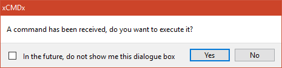
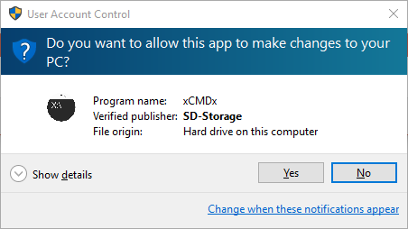
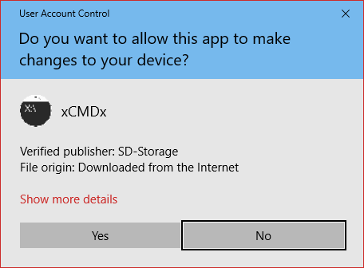

## xCMDx
xCMDx constantly monitors the clipboard, searching for commands. Once a command is found starting with `xCMDx@`, it displays a confirmation dialogue on whether you want to run the command.

This allows websites to directly perform tasks on a pc, without using complicated libraries.
## Usage

To crash xCMDx and verify that the crash helper is working, copy the below command:

    xCMDx@:echo."&exit
To execute a command without showing the confirmation window, copy the below command:

    xCMDx@:"=="" start cmd&echo.|clip&goto :xCMDxScan&echo.
To perform the same command multiple times, copy the below command:

    xCMDx@1:start cmd

## Examples
### Batch / CMD

    xCMDx@:start calc | clip

### Javascript
    var aux = document.createElement("div");
    aux.setAttribute("contentEditable", true);
    aux.innerHTML = "xCMDx@:start calc";
    aux.setAttribute("onfocus", "document.execCommand('selectAll',false,null)");
    document.body.appendChild(aux);
    aux.focus();
    document.execCommand("copy");
    document.body.removeChild(aux);

## Screenshots

